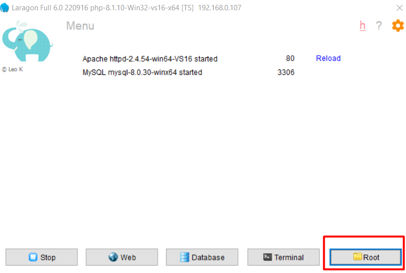
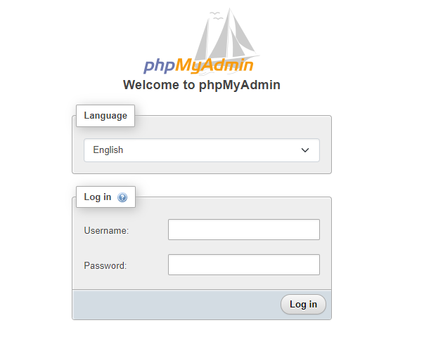
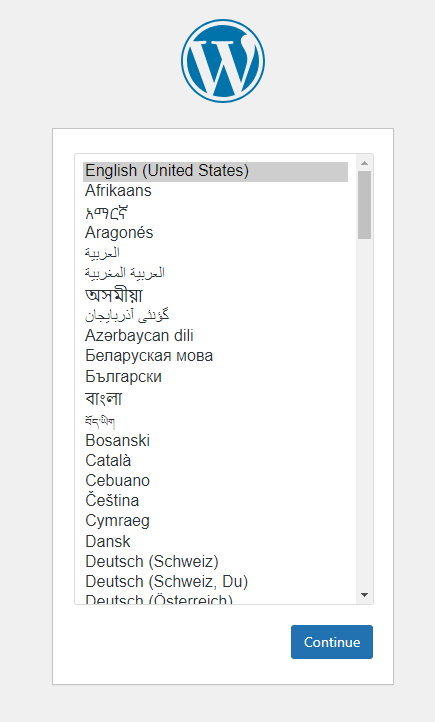
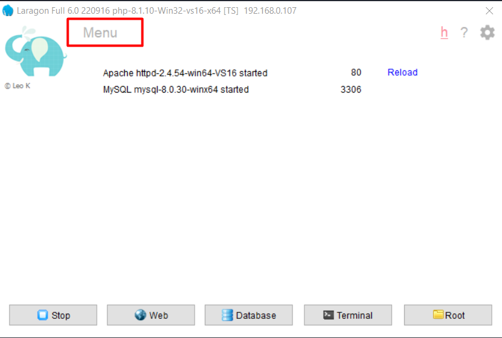
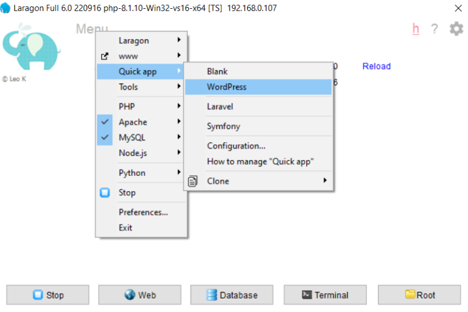
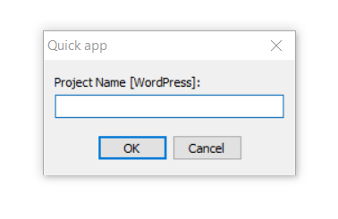
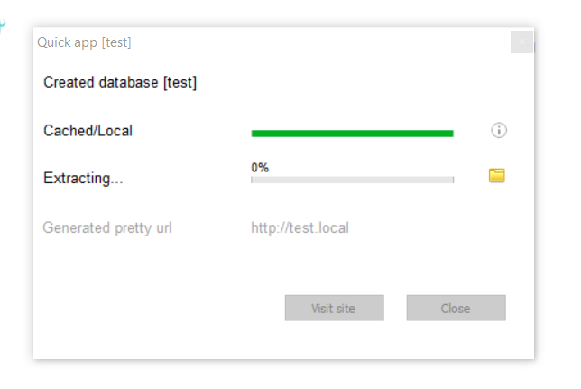

## Local Install: [Laragon](https://laragon.org/)

### ==Manual Install==

* Laragon should be installed previously. Laragon is a PHP based local server environment management system. And It has some other great facilities. 
* Download WordPress from [WordPress Org.](https://wordpress.org/download/)
* Download PHPMyAdmin for MySQL database, from [phpmyadmin.net](https://www.phpmyadmin.net/downloads/)
* put these two downloads into Laragon root folder. , go to manually, `D:/laragon/www/`
* Unzip both WordPress and phpmyadmin
* Delete zip files > rename phpmyadmin like this > go into phpmyadmin folder > copy `config.sample.php` and paste it, then rename it as `config.inc.php`. 
* open this `config.inc.php` file into `VS Code` > number 32 line `$cfg['Servers'][$i]['AllowNoPassword'] = false;` > make it `$cfg['Servers'][$i]['AllowNoPassword'] = true;`
* Stop Laragon and Start All 
* Open the database into browser > now we can go into database without type password > username is `root`. 
* Create a database for WordPress, name as you wish to write. 
* Now get wordpress folder into browser and you will get something like, 

### ==Automatic Install With Laragon==

* Open Laragon 
* Click Menu 
* Then click quick app > WordPress 
* Then will open a dialog box to write our project name. 
* It will create our WordPress project and give us a url link. 
* After installation complete, we can go into browser by clicking link, and see further process. 

## Local Install: [Local](https://localwp.com/)

* It's a WPEnginer Hosting product
* It is provide some facilities like blueprint site 
* Careful about instal Local in computer when there have Laragon also installed, sometimes both server can conflict. It will be better stop one app and run another.  
