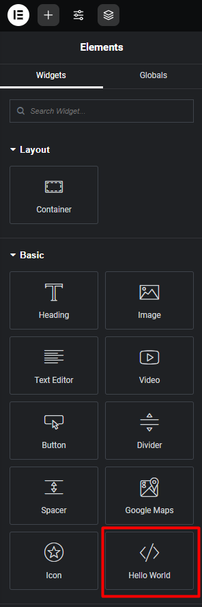

## Elementor Addon Development

* To create functional change or development, we can work on child theme's `functions.php`

Add these code into `functions.php`

```php

    <?php

    if (in_array('elementor/elementor.php', apply_filters("active_plugins", get_option('active_plugins')))) {
        
        require_once("elementor-addons/addons.php");

    } else {
    
        // Add admin notice if elementor is not installed
        function my_custom_admin_notice(){
            ?>
                <div class="notice notice-warning">
                    <p><?php echo "This theme requires elementor to be installed" ?></p>
                </div>
            <?php
        }

        add_action("admin_notices", "my_custom_admin_notice");
    }

```

* Into `elementor-addons` folder we have a file name `addons.php` & a folder name `widgets`

In `addons.php` we need to add code

```php

    <?php

    function mhasan_theme_child_widget( $widgets_manager ) {

        require_once( __DIR__ . '/widgets/hello-world.php' );

        $widgets_manager->register( new \Mhasan_Elementor_Addon_Hello_World() );

    }

    add_action( 'elementor/widgets/register', 'mhasan_theme_child_widget' );

```

* In widgets folder we have our elementor widget, we can name it `hello-world.php`, in this file we need to have this code

```php

    <?php
    class Mhasan_Elementor_Addon_Hello_World extends \Elementor\Widget_Base {

        public function get_name() {
            return 'mhasan_hello_world';
        }

        public function get_title() {
            return esc_html__( 'Hello World', 'elementor-addon' );
        }

        public function get_icon() {
            return 'eicon-code';
        }

        public function get_categories() {
            return [ 'basic' ];
        }

        public function get_keywords() {
            return [ 'hello', 'world' ];
        }

        protected function render() {
            ?>

                <p> Hello World </p>

            <?php
        }
    }

```

After that we can now check out elementor addons in elementor widgets section basic area.



---
### Read

* [Elementor Developer](https://developers.elementor.com/)


