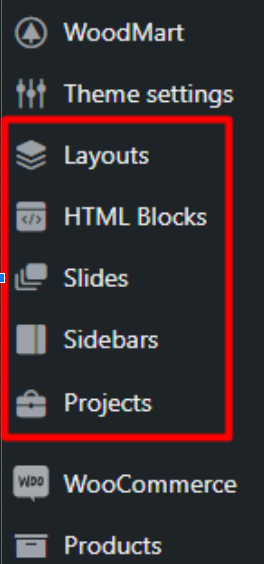

# Custom Post Type

Before talking about custom post types, let’s talk about WP default post types. WP has these post type; these are

* Post
* Page
* Attachment
* Revision
* Navigation Menu

## What is Custom Post Type?

Custom Post Type or Custom Fields is something that we can have like post type (which have in WP default) in custom, like checkout in WoodMart theme, like this



## CPT Types

Custom Post Type is important when we need custom-type content instead of blog posts or Pages. Instead of a Blog Or Page post type, we can have custom post type like for,

* For portfolio content
* For slides, use in various place of the website
* HTML block
* For Directory
* For Property

## Create CPT by Plugins

Several plugins offer CPT (custom post type) features

* Advanced Custom Fields
* CPT UI (Custom Post Type UI)
* Meta Box
* Crocoblock JetEngine Post Types

## Create CPT by code

We can create custom types without any plugins With this code,

```php
/**
 * Register Custom Post Type: Directory
 */
function create_posttype() {
    register_post_type('directory', 
        array(
            'labels' => array(
                'name'          => __( 'HTML Blocks', 'text-domain' ),
                'singular_name' => __( 'Business', 'text-domain' )
            ),
            'public'        => true,
            'has_archive'   => true,
            'rewrite'       => array('slug' => 'business'),
            'show_in_rest'  => true, // Enables Gutenberg support
            'supports'      => array('title', 'editor', 'thumbnail') // Adds support for content features
        )
    );
}
// Hook function to theme setup
add_action('init', 'create_posttype');
```
