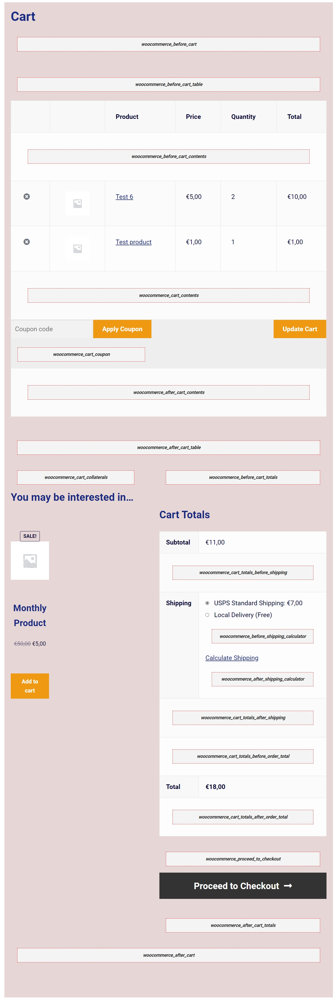

## Visual Hooks Guides: Cart Page

* WooCommerce Cart page visual hook guide 

* WooCommerce Cart page Default `add_actions`

```php
// These are actions you can unhook/remove! 
add_action( 'woocommerce_before_cart', 'woocommerce_output_all_notices', 10 );
add_action( 'woocommerce_cart_collaterals', 'woocommerce_cross_sell_display' );
add_action( 'woocommerce_cart_collaterals', 'woocommerce_cart_totals', 10 );
add_action( 'woocommerce_proceed_to_checkout', 'woocommerce_button_proceed_to_checkout', 20 );
```
* For details we can check out this page [Business Bloomers Visual Hook Guide: Cart Page](https://www.businessbloomer.com/woocommerce-visual-hook-guide-cart-page/)