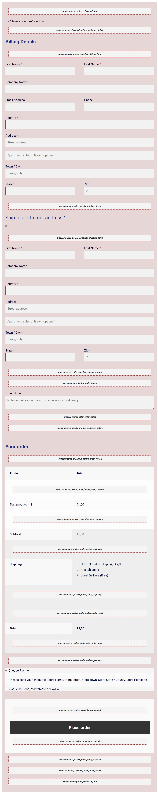

## Visual Hooks Guides: Checkout Page

* WooCommerce Checkout page visual hook guide 

* WooCommerce Checkout page Default `add_actions`

```php
// These are actions you can unhook/remove!
 
add_action( 'woocommerce_before_checkout_form', 'woocommerce_checkout_login_form', 10 );
add_action( 'woocommerce_before_checkout_form', 'woocommerce_checkout_coupon_form', 10 );
add_action( 'woocommerce_before_checkout_form', 'woocommerce_output_all_notices', 10 );
 
add_action( 'woocommerce_checkout_billing', array( self::$instance, 'checkout_form_billing' ) );
add_action( 'woocommerce_checkout_shipping', array( self::$instance, 'checkout_form_shipping' ) );
 
add_action( 'woocommerce_checkout_order_review', 'woocommerce_order_review', 10 );
add_action( 'woocommerce_checkout_order_review', 'woocommerce_checkout_payment', 20 );
```