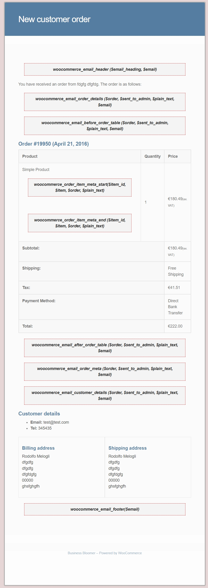

## Visual Hooks Guides: Email

* WooCommerce email visual hook guide 

* WooCommerce Email Default `add_actions`

```php
// --------------------------------------
// These are actions you can unhook/remove!
// You must use $object inside remove_action
// Where $object = WC()->mailer();
// --------------------------------------
 
// Email Header, Footer and content hooks
 
add_action( 'woocommerce_email_header', array( $object, 'email_header' ) );
add_action( 'woocommerce_email_footer', array( $object, 'email_footer' ) );
add_action( 'woocommerce_email_order_details', array( $object, 'order_details' ), 10, 4 );
add_action( 'woocommerce_email_order_details', array( $object, 'order_schema_markup' ), 20, 4 );
add_action( 'woocommerce_email_order_meta', array( $object, 'order_meta' ), 10, 3 );
add_action( 'woocommerce_email_customer_details', array( $object, 'customer_details' ), 10, 3 );
add_action( 'woocommerce_email_customer_details', array( $object, 'email_addresses' ), 20, 3 );
add_action( 'woocommerce_email_order_details', array( $this, 'generate_order_data' ), 20, 3 );
add_action( 'woocommerce_email_order_details', array( $this, 'output_email_structured_data' ), 30, 3 );
 
// New Order email only
 
add_action( 'woocommerce_email_footer', array( $this, 'mobile_messaging' ), 9 ); 
 
// Customer emails if BACS / COD / cheque payment
 
add_action( 'woocommerce_email_before_order_table', array( $this, 'email_instructions' ), 10, 3 );
```