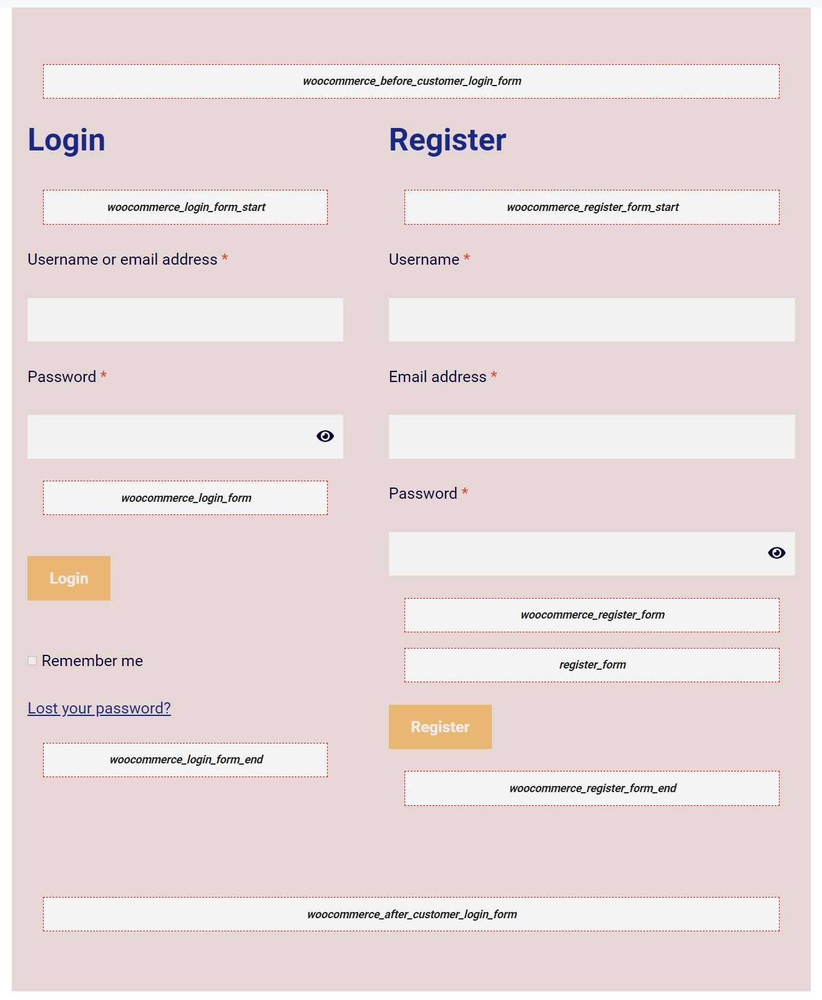
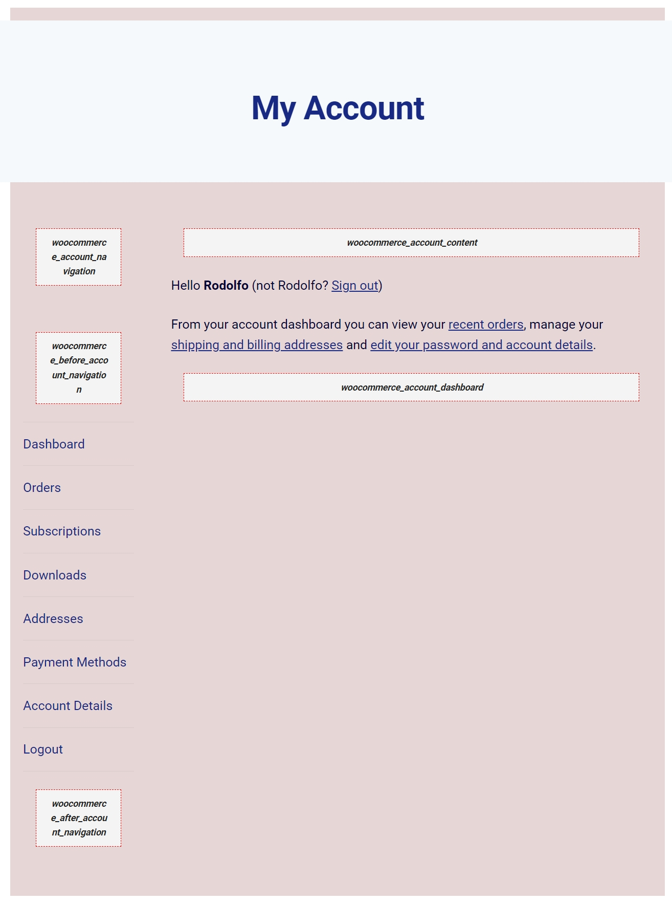
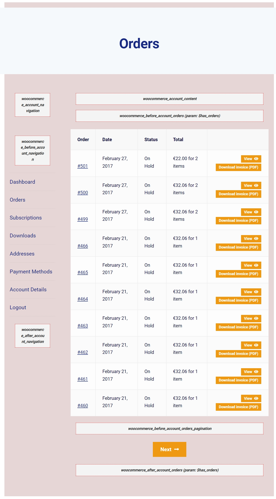
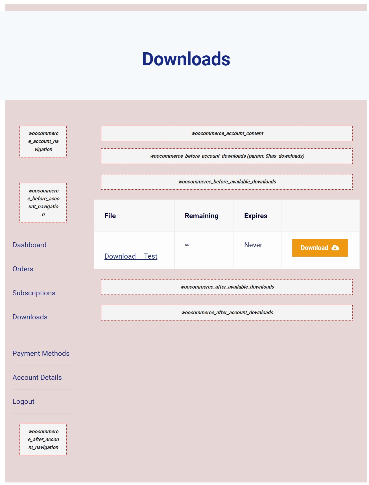
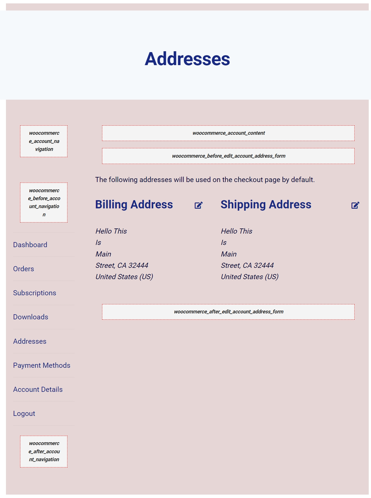
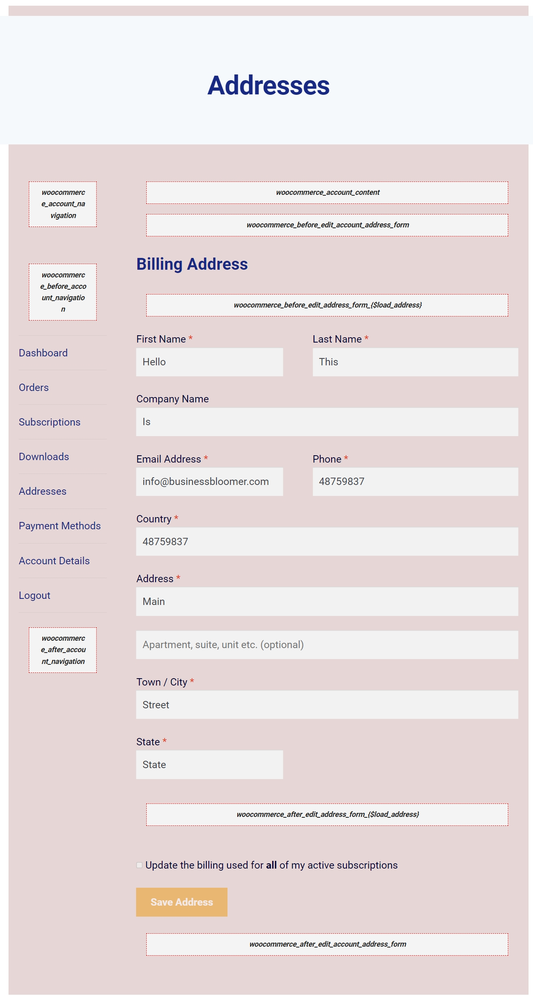
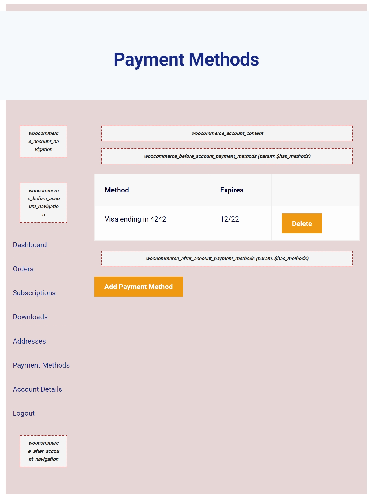
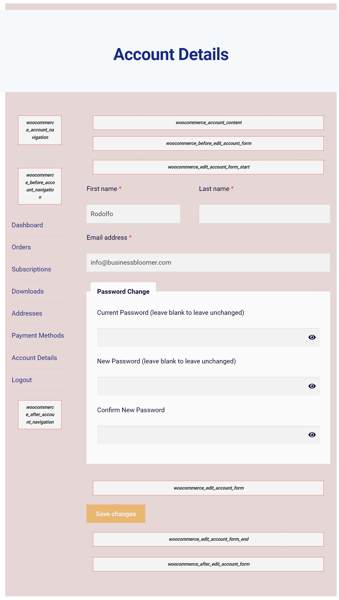

## Visual Hooks Guides: My Account Pages

* WooCommerce My Account: User Logged Out (Login/Register Page) visual hook guide 

* WooCommerce My Account Page – User Logged In – Dashboard - Visual hook guide 

* WooCommerce My Account Page – User Logged In – Orders - Visual hook guide 

* WooCommerce My Account Page – User Logged In – Downloads - Visual hook guide 

* WooCommerce My Account Page – User Logged In – Addresses - Visual hook guide 

* WooCommerce My Account Page – User Logged In – Edit Address - Visual hook guide  

* WooCommerce My Account Page – User Logged In – Payment Methods - Visual hook guide 

* WooCommerce My Account Page – User Logged In – Account Details - Visual hook guide 
